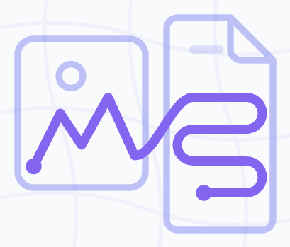
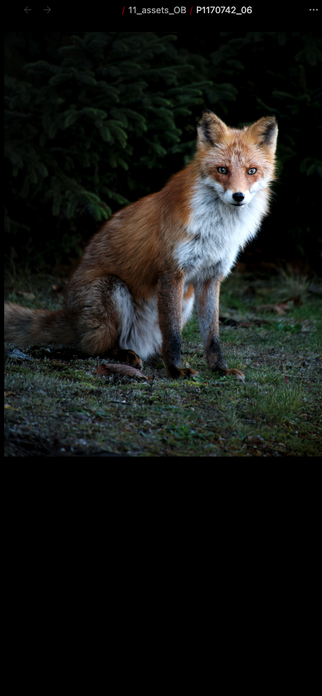
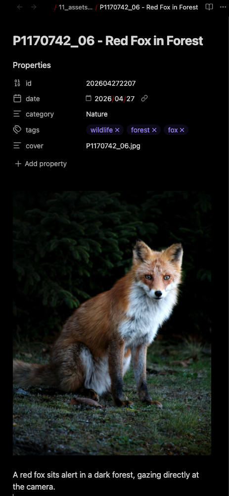

  

  <strong style="font-size: x-large;">Asset Weaver for <a href="https://obsidian.md/">Obsidian.md</a></strong>

  
  
  
  

## Overview

An Obsidian plugin that autonomously scans your vault for untagged image assets and leverages a local Vision-Language Model (VLM) to generate structured markdown sidecar files. Perfect for creative professionals, artists, and researchers looking to weave their visual libraries into their knowledge graphs without relying on cloud APIs.

### Visual Comparison (Before vs. After)
| Before (Image Only) | After (Weaved Metadata) |
|:---:|:---:|
|  |  |

## Features

- **Automated Metadata Generation**: Analyzes images to generate a descriptive title, category, keywords, and a short description.
- **Sidecar Markdown Creation**: Creates a markdown note alongside your image containing the generated YAML frontmatter, making your images searchable and easily queryable in Obsidian.
- **Backlink Extraction**: Automatically detects and lists other notes in your vault that embed or link to the image.
- **Privacy First (Local AI)**: Designed to work seamlessly with local LLM/VLM servers like [LM Studio](https://lmstudio.ai/) or [Ollama](https://ollama.com/), ensuring your assets never leave your machine.
- **Batch Processing**: Scans your designated asset folder and processes all untagged images sequentially to manage server load.

## Prerequisites

This plugin requires an OpenAI-compatible API endpoint that supports Vision capabilities. We highly recommend using a local VLM for privacy and cost-efficiency.

### Recommended Local Setup (LM Studio)
1. Download and install [LM Studio](https://lmstudio.ai/).
2. Search and download a Vision-Language Model (e.g., `qwen2-vl-7b-instruct` or `llava`).
3. Load the model and go to the **Local Server** tab (`<->`).
4. Click **Start Server**. Note the port number (default is usually `1234`).

## Installation

### Manual Installation (Current)
1. Download the latest release (`main.js`, `manifest.json`, `styles.css`) from the Releases page.
2. Create a folder named `asset-weaver` in your vault's `.obsidian/plugins/` directory.
3. Place the downloaded files into that folder.
4. Reload Obsidian and enable the plugin in **Settings -> Community plugins**.

## Configuration

Go to Obsidian **Settings -> AssetWeaver Settings** to configure the plugin:

- **API Base URL**: The endpoint of your local server. For LM Studio, use `http://localhost:1234/v1`. For Ollama, use `http://localhost:11434/v1`.
- **Model Name**: The exact name of the model you have loaded (e.g., `qwen2-vl:7b`).
- **API Key**: A dummy key (e.g., `lm-studio`) for local servers, or your actual API key if using a remote service.
- **Target Folder**: The path to the folder in your vault where your images are stored (e.g., `11_assets_OB`).

## How to Use

1. Ensure your local VLM server is running.
2. Place your image files (`.jpg`, `.png`, `.webp`, etc.) into your designated Target Folder.
3. Click the **"Run AssetWeaver"** ribbon icon on the left sidebar, or open the Command Palette (`Ctrl/Cmd + P`) and run **"Scan and weave new assets"**.
4. The plugin will scan the folder for images that do not have a corresponding markdown sidecar file.
5. It will process the new images sequentially, generating detailed markdown files with YAML metadata right next to your images.

## Troubleshooting & Technical Details

During the development of this plugin, several edge cases were identified and resolved to ensure enterprise-grade stability:

### 1. VLM Memory Overload & Connection Timeouts
**Issue**: Sending raw, high-resolution images (e.g., 4K photos or large screenshots) converted to Base64 resulted in massive payload sizes (7MB+). This frequently caused the local VLM server (LM Studio) to crash due to out-of-memory (OOM) errors or connection timeouts.
**Solution**: Implemented an internal HTML5 `<canvas>` API resizer. Before sending any request, the plugin automatically scales images down to a maximum of `768px` and compresses them to JPEG. This reduces the payload size to mere kilobytes, ensuring rapid, stable inference without freezing the user's machine.

### 2. Malformed JSON from VLMs (Unescaped Quotes)
**Issue**: When analyzing screenshots containing text, VLMs often attempt to quote the extracted text directly in the JSON response (e.g., `"description": "A screenshot of a "text" prompt."`). This results in unescaped double quotes, causing `JSON.parse` to fail and the batch process to halt.
**Solution**: Applied strict prompt engineering explicitly forbidding unescaped double quotes, combined with a custom Regular Expression (`jsonString.replace(...)`) cleanup step that catches and sanitizes common escaping mistakes before parsing the JSON object.

### 3. Invisible Corrupted Files (0-Byte Files)
**Issue**: Synchronization engines (like Syncthing) or clipboard failures sometimes leave invisible 0-byte `.png` placeholder files in the vault. Attempting to draw an empty blob to the HTML5 Canvas causes the `img.onerror` event to fire with a non-standard `Event` object, leading to confusing `undefined` error logs.
**Solution**: Added a strict pre-flight check (`binary.byteLength === 0`). The plugin gracefully catches 0-byte files, skips them safely, and notifies the user directly in the Obsidian UI exactly which file is corrupted.

### 4. Obsidian API Backlink Limitations for Images
**Issue**: Using Obsidian's standard `app.metadataCache.resolvedLinks` API failed to detect links pointing to images, as `resolvedLinks` only tracks Markdown-to-Markdown links.
**Solution**: Engineered a custom vault-wide scanner that iterates through all markdown files (`app.vault.getMarkdownFiles()`) and reads their individual metadata caches (`cache.links` and `cache.embeds`). This ensures that every single `[[image.jpg]]` or `![[image.jpg]]` reference is accurately mapped and included in the sidecar's YAML `linked_notes` array.

## License

## Origins

AssetWeaver originated from an experimental Python-based image archival workflow initially developed to manage large-scale creative image collections inside Obsidian. That prototype informed the design and architecture of this Obsidian plugin.

---

# AssetWeaver (日本語)

## 開発の背景
AssetWeaverは、もともとObsidian内の大規模なクリエイティブ画像コレクションを管理するために開発された、実験的なPythonベースの画像アーカイブ・ワークフローに端を発します。そのプロトタイプでの知見が、本Obsidianプラグインの設計とアーキテクチャに活かされています。

## 特徴
- **メタデータの自動生成**: 画像を分析し、説明的なタイトル、カテゴリ、キーワード、および一文の説明を生成します。
- **サイドカーMarkdownの作成**: 画像の隣にYAMLフロントマターを含むMarkdownノートを作成し、Obsidian内での検索やDataviewによるクエリを容易にします。
- **バックリンクの自動抽出**: Vault内の他のノートからその画像が参照（埋め込み・リンク）されている箇所を自動検出し、リスト化します。
- **プライバシー重視（ローカルAI）**: [LM Studio](https://lmstudio.ai/)や[Ollama](https://ollama.com/)などのローカルサーバーとシームレスに連携。データが外部へ送信されることはありません。
- **一括バッチ処理**: 指定したフォルダ内の未処理画像を自動的に検出し、サーバーの負荷を抑えながら順次処理します。

## トラブルシューティングと技術的詳細
...

本プラグインの開発過程で、安定性を高めるために解決したいくつかの技術的課題を紹介します：

### 1. VLMのメモリ負荷とタイムアウト
**課題**: 高解像度の画像をそのままBase64変換して送信すると、ペイロードが巨大（7MB以上）になり、ローカルサーバーがクラッシュしたりタイムアウトしたりすることがありました。
**解決策**: HTML5 `<canvas>` APIを用いた内蔵リサイズ機能を実装。送信前に画像を最大 `768px` にリサイズ・JPEG圧縮することで、ペイロードを数百KBまで削減し、高速かつ安定した推論を実現しました。

### 2. AIによるJSON出力の破損（クォーテーション問題）
**課題**: スクリーンショット内のテキストを読み取る際、AIがJSON文字列内でダブルクォーテーションをそのまま使ってしまい、パースエラーが発生することがありました。
**解決策**: プロンプトエンジニアリングによってクォーテーションの厳格な使用を指示。さらに、パース直前に正規表現によるクリーンアップ処理を挟むことで、AIの出力ミスを柔軟に吸収します。

### 3. 0バイトの破損ファイルの処理
**課題**: 同期エラー等で発生した中身が空（0バイト）の画像ファイルを読み込もうとすると、エラーが発生して処理が止まってしまうことがありました。
**解決策**: ファイル読み込み時にバイト数チェックを導入。破損ファイルを検知した場合は、ユーザーに通知を出した上で安全にスキップし、他の画像の処理を継続させます。

### 4. 画像に対するバックリンクの取得制限
**課題**: Obsidian標準の `resolvedLinks` APIはMarkdown間のリンクしか保持しておらず、画像へのリンクを検出できませんでした。
**解決策**: Vault内の全Markdownファイルを走査し、メタデータキャッシュから直接画像への参照を抽出するカスタムスキャナーを構築。正確な `linked_notes` のリストアップを実現しました。

## ライセンス

MIT License
