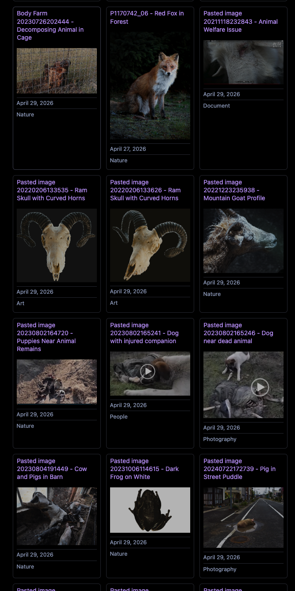

# Dataview Integration Guide

After AssetWeaver processes your images, you can use [Dataview](https://github.com/blacksmithgu/obsidian-dataview) to create smart galleries and query your assets by tags, categories, and other metadata.

---

## Query: Gallery with Cover Images

```dataview
TABLE without id
"![[" & file.cover & "|300]]" as Cover,
file.link as Name,
file.tags as Tags
FROM "11_assets_OB"
WHERE contains(file.tags, "animal")
SORT file.ctime DESC
```

### What This Does

1. **Scans** all `.md` sidecar files in `11_assets_OB/`
2. **Filters** for files containing `#animal` in their tags
3. **Displays** a gallery with cover images (300px width)
4. **Links** to the full metadata file for each asset

### Result Preview



---

## Alternative Query: Linked File Names

```dataview
TABLE without id
"[[" & file.link & "|" & file.cover & "]]" as "Animal Images"
FROM "" 
WHERE contains(file.tags, "animal")
SORT file.mtime DESC
```

This variation links the image name directly to the cover file.

---

## How Sidecar Data Enables These Queries

When AssetWeaver processes an image, it creates a `.md` sidecar file like this:

```yaml
---
title: A red fox in the forest
category: Nature
tags: [animal, wildlife, fox]
cover: Pasted image 001.png
linked_notes: []
processed_at: 2026-05-01 11:00
---
```

The `tags` and `cover` fields in the YAML frontmatter are what make Dataview queries possible. Dataview reads these fields and displays them in a table or gallery view.

> **Tip**: AssetWeaver automatically adds tags like `#animal`, `#landscape`, `#portrait`, etc. to your image metadata. Use Dataview to build custom views!
