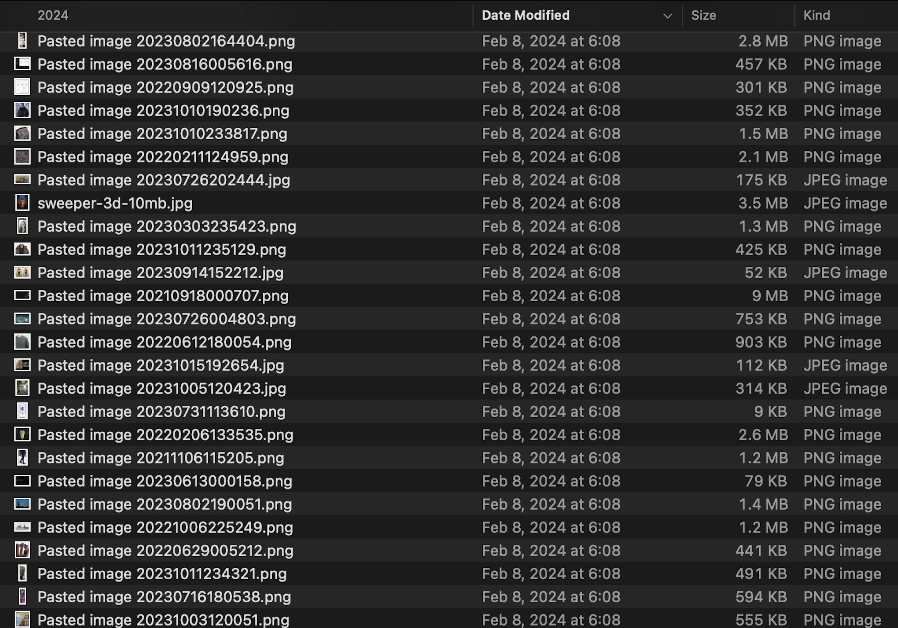
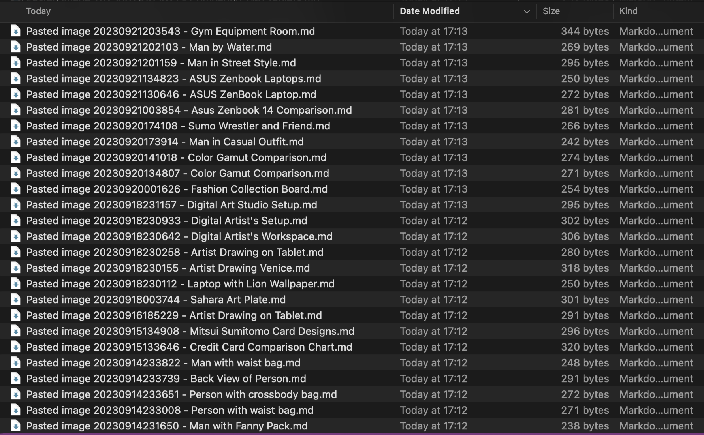

# Library-Scale Transformation

AssetWeaver transforms your vault's raw image assets into a structured, searchable library by using a local Vision-Language Model to generate rich metadata.

### At Scale: From Raw Image to Structured Markdown

Thousands of generic filenames (`Pasted image 1.png`, `Screenshot 2026-05-11 at 23.15.58.png`) become structured markdown documents — each image paired with an AI-generated sidecar of titles, tags, descriptions, and backlinks.

